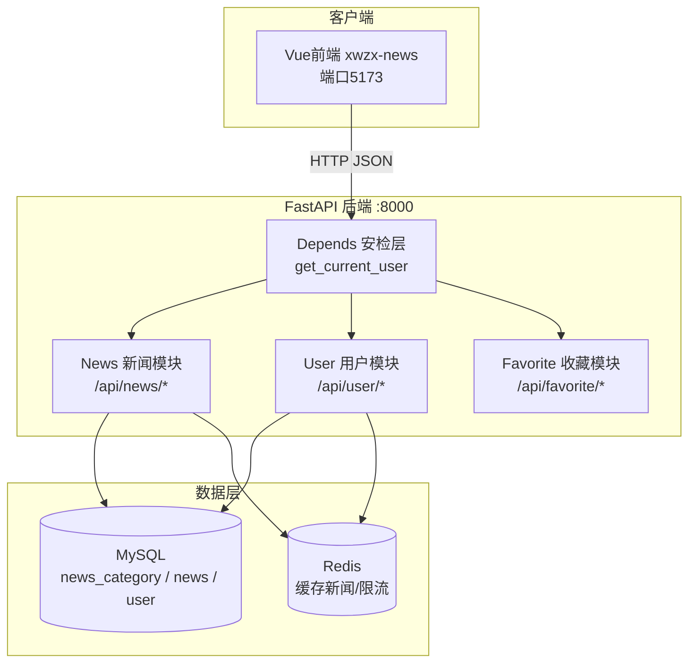
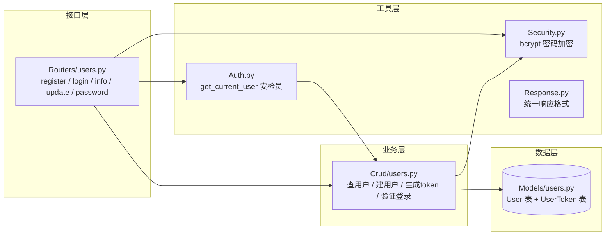
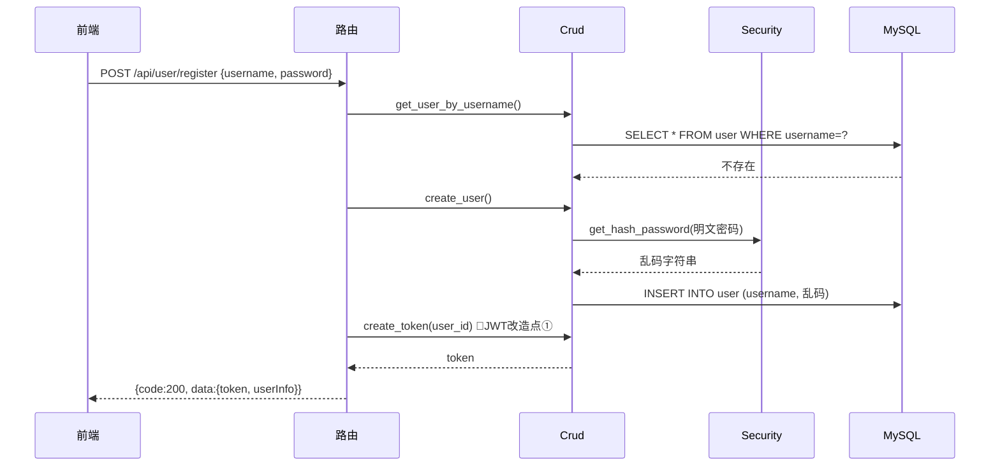
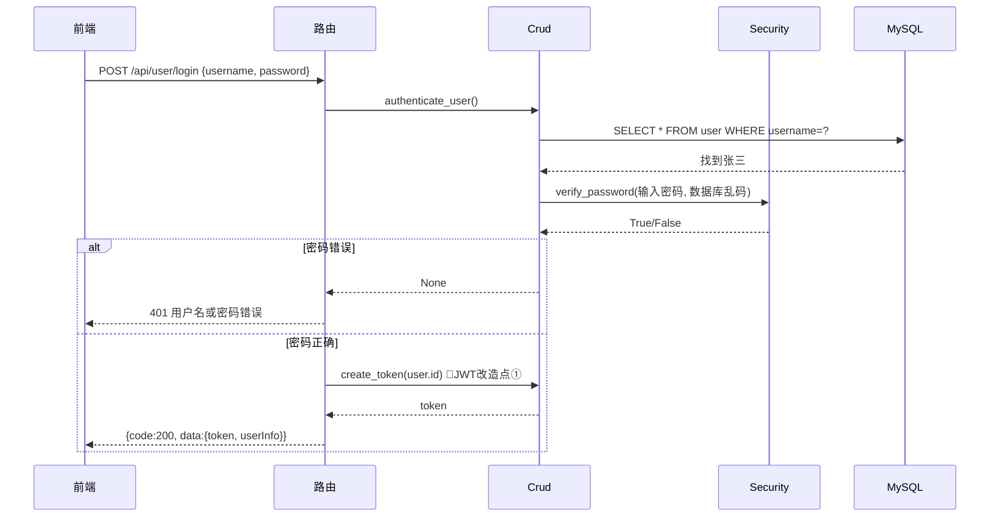
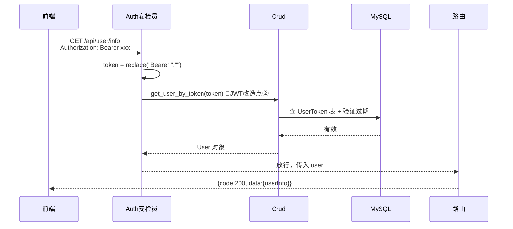

# 今日头条项目架构地图

> 用法：**先看层级2（整体框架）建立全局观，再看层级3（当前细节）理解数据流。**
> 每写一个模块，更新对应图——图跟着代码进化。

---

## 层级 2：整体框架（Container 视图）

**阅读顺序**：前端(5173) → 安检(Depends) → 各模块路由 → 数据库/缓存

---

## 层级 3：用户模块细节（Component 视图）

### 3.1 文件分工

### 3.2 注册流程（时序图）

### 3.3 登录流程（时序图）

### 3.4 鉴权流程（带 token 访问）

---

## JWT 改造对照表（只改两处）

| 位置 | UUID 版（老师） | JWT 版（改造后） |
|------|----------------|-----------------|
| create_token | `str(uuid.uuid4())` + 存 UserToken 表 | `jwt.encode({sub, exp}, SECRET_KEY)` 不存库 |
| get_user_by_token | 查 UserToken 表 → 验过期 → 查 User | `jwt.decode(token, SECRET_KEY)` → 取 sub → 查 User |
| UserToken 表 | 需要 | 可以删掉 |
| 前端 | 零改动 | 零改动 |

**改造原则：接口契约（响应格式 + Authorization 头）不变，前端就安全。**
